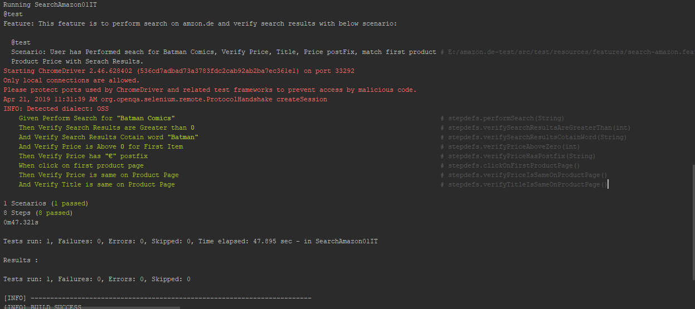

# `Amazon.de Search Tests` [amazon.de](http://www.amazon.de)

### TestFramwork Consists of
1. Selenium WebDriver with Java
2. Junit for test assertions
2. Cucumber to Run Feature Files
3. Maven to run Tests

### How to Setup and Run Tests
1. First clone the project in your local environment. 
2. Import Project as Maven Project. This will install all dependencies.
3. To run the tests enter the command mvn clean test in terminal

### Once all successful tests are run, you should see below output.

